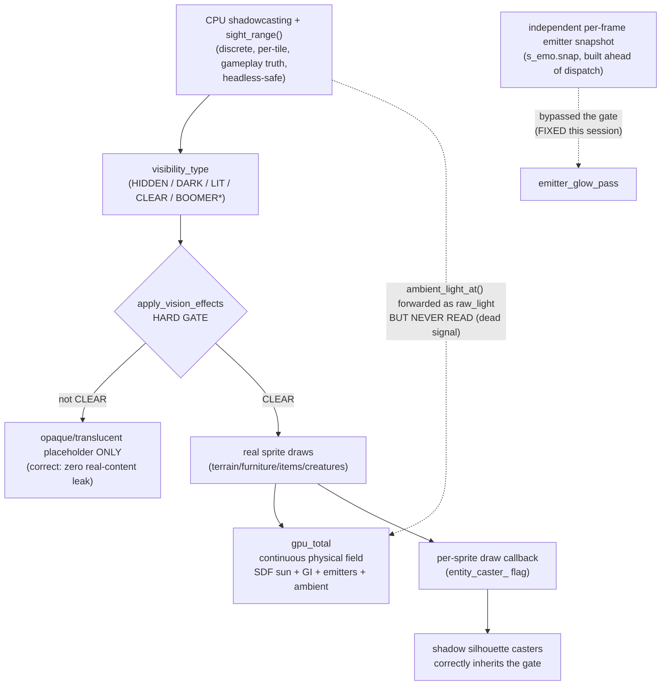

# GPU/CPU Lighting–Vision Unification — Investigation Report

Status: **investigation complete, no unification decision made yet**. One concrete bug fixed
and landed (see "Landed this session"). Everything else in this document is findings and
options for a planning agent to scope into an actual plan — it does not commit to Option 3
or to the LOS-loosening fork; both are explicitly left open for a decision.

## How we got here

1. User observed: rooms inside buildings can render visibly lit via GPU lighting even though
   the player's mechanical vision radius is small — "feels wrong."
2. First hypothesis (this session) was too narrow: `emitter_glow_pass`, a decorative
   "smoke and mirrors" torch/lamp glow added earlier this same session, drew a glow instance
   for every OMNI emitter within 48 tiles of the camera with **zero CPU visibility gating** —
   no wall occlusion, no `visibility_cache` check at all. Confirmed by direct code read
   (`src/sdl_render_frame.cpp`, the `glow_instances` loop), not inferred. **Fixed and landed**
   (see below) — but the user correctly pushed back that this was not the actual source of
   the original complaint, only a contributing, separate bug.
3. Second hypothesis, confirmed with hard evidence: `sprite_instance::cutout_pad1` is
   populated in `cata_tiles.cpp:2165` directly from `map::ambient_light_at(pos)` — the same
   CPU light value that feeds `Character::sight_range()` — and is threaded correctly all the
   way through `sprite.vert.hlsl` / `sprite.frag.hlsl` as a `raw_light` varying (TEXCOORD9,
   mirrors the `caster` varying's plumbing). It is **never read** anywhere past its own
   declaration in the fragment shader (confirmed via grep: zero consumers). Meanwhile
   `gpu_total` (`sprite.frag.hlsl` ~line 1090: `min(ambient_v + dyn, 2.0) * cloud_vis *
   sun_shad_mul + emitter_light`) is the sole determinant of a lit sprite's rendered
   brightness, computed with **no reference at all** to the CPU's own opinion of that tile's
   light level. This is real, confirmed, and still open — see Option 3 below.
4. A tempting but WRONG fix was drafted and retracted before landing: `apply_vision_effects`
   (`cata_tiles.cpp:2838`) draws a translucent (alpha 204/191, not 255) tint sprite for
   `VIS_DARK`/`VIS_LIT`, versus a fully opaque (alpha 255) tint for
   `VIS_HIDDEN`/`VIS_BOOMER`/`VIS_BOOMER_DARK`. It is tempting to read the non-255 alpha as
   "this overlay is meant to composite over real content" and change the callers to draw the
   tile's real terrain/furniture/trap/vpart underneath the translucent tint instead of
   skipping it entirely. **This is wrong and must not be done.** `map.cpp:972-990`
   (`map::get_visibility`) documents `lit_level::DARK` as *"can't see this square at all"* and
   `lit_level::BRIGHT_ONLY` as *"can only tell that this square is bright"* — both mean the
   player categorically cannot perceive the square's real content, not "real LOS but dim."
   Drawing real content under those tints would (a) leak real map information — trap
   positions, furniture layout, item placement — into squares the game design explicitly
   marks imperceptible, and (b) because the same draw path
   (`cata_tiles.cpp:1663`, "calling draw to memorize everything") has a
   `check_and_set_seen_cache` side effect, it would **permanently** write that leaked
   information into the player's persistent map-memory — a savefile-persistent information
   leak, not a transient rendering artifact. The non-255 alpha on the DARK/LIT tints is very
   likely a purely aesthetic softening choice against neighbouring overlays, not a design
   signal about compositing real content.
5. Contrasting two same-era ("Phase 2.3") GPU decorative systems revealed a generalizable
   pattern explaining exactly why one had the bug and the other didn't (detail below).

## Current architecture, as verified in code

| Layer | Computes | Nature | Consumers |
|---|---|---|---|
| CPU shadowcasting + `sight_range()` (`character_vision.cpp:388`) | `lit_level` per tile | Discrete, per-tile, gameplay-authoritative, headless-safe | monster AI `sees()`/`is_visible_in_range()`, stealth, overmap sight |
| `map::get_visibility()` (`map.cpp:972`) | `visibility_type` (HIDDEN/CLEAR/LIT/DARK/BOOMER/BOOMER_DARK) | Discrete, derived 1:1 from `lit_level` | render dispatch, memory writes |
| `apply_vision_effects` (`cata_tiles.cpp:2838`) | which sprite reaches the GPU at all: real content vs. placeholder | Hard per-tile gate — the **only** place these two regimes currently meet | render dispatch |
| GPU lighting (SDF sun shadows, GI bounce, ambient, emitters) | `gpu_total` per pixel (`sprite.frag.hlsl:1090`) | Continuous spatial field, physically-inspired, intentionally rich (this project already moved off a blocky tile-resolution occupancy march specifically to get this) | rendered frame only |
| Screen-space decoration (bloom, emitter glow, silhouette shadows) | post-process / additive effects over the composited frame | Continuous, spatial extent beyond one tile | rendered frame only |
| Map memory (`get_memorized_tile`, seen-cache) | persisted last-seen appearance | Discrete, per-tile, write-gated by the vision layer | later renders when out of sight |

## The core tension, stated precisely

Two independent, disagreeing definitions of "how bright/perceivable is this tile" coexist,
and interact at exactly one hard boundary (`apply_vision_effects`). Within `VIS_CLEAR`, GPU
lighting is fully free and uncoupled from what CPU math would predict for that same spot.

## Unification options considered

### Option 1 — Single source of truth downward (CPU authoritative, GPU derives)
Make GPU per-tile brightness come strictly from a per-tile CPU light value (e.g. upsample/
smooth the existing `lit_level`/`ambient_light_at` grid into a GPU texture, sampled and
blurred for softness), and disallow GPU radiance from exceeding what it implies.

- **Pros:** total consistency by construction — CPU and GPU literally cannot disagree.
- **Rejected because:** this discards essentially all of the already-shipped GPU lighting
  investment — SDF sphere-traced sun shadows (chosen over a shadowmap specifically because
  they reuse rich per-pixel geometry the CPU grid does not have), GI bounce, per-emitter
  physically-derived falloff/color, bloom-worthy HDR peaks. A single CPU scalar per tile is a
  materially poorer signal than any of that; clamping GPU to it is a visual-fidelity
  regression, not a fix, and reverses several past sessions of deliberate rendering work
  (documented: the SDF+SkyVis rewrite, GI bounce, and the sun-shadow SDF retarget were all
  chosen specifically for richness a CPU-only signal cannot provide).

### Option 2 — Feedback upward (GPU authoritative, CPU derives)
Down-sample the rendered `gpu_total` back into a per-tile `lit_level` so `sight_range()` /
monster AI / `visibility_cache` follow what's actually rendered.

- **Pros:** directly answers the user's original framing — "the room really is lit, so the
  game should agree."
- **Rejected because:**
  - **Headless/determinism break:** `cata_test-tiles` has no real GPU device (confirmed:
    `SDL_GPU: device creation failed` appears in every test run) and exercises vision purely
    through the CPU shadowcasting fallback. Making gameplay depend on GPU-rendered state
    would make an entire class of vision/monster-AI tests either unrunnable headlessly or
    require synthesizing a fake GPU-shaped answer, undermining the CPU/GPU decoupling this
    project already deliberately relies on for its test architecture.
  - **Co-op/server-authority break:** monster AI and sight need to be reproducible
    independent of any one client's render settings, GPU tier, or zoom level — this project
    has a co-op surface where that symmetry matters.
  - **Circular ordering hazard:** rendering for frame N would need frame N's own visibility
    decision, which would need lighting derived from frame N's render — a real ordering/
    latency problem (`build_map_cache` must resolve before the renderer decides what to draw
    today), not just a philosophical one.

### Option 3 — Loose coupling / reference wire (recommended scope; NOT implemented yet)
Keep both systems fully autonomous; keep `apply_vision_effects` as the only hard boundary.
Wire the already-threaded, currently-dead `raw_light` value into `gpu_total` as a soft
anchor/ceiling, applied **only** to already-`VIS_CLEAR` tiles, so a tile that just barely
crossed the CPU visibility threshold can't render dramatically brighter than what let it
become visible in the first place, while GPU's richer result still comes through within a
reasonable bound.

- **Pros:** no information-leak risk (`VIS_CLEAR` tiles were always going to render in full);
  no headless/determinism risk (CPU vision computation is completely untouched — this is a
  render-only, feed-forward wire); reuses infrastructure already built and shipped (the
  varying exists in both shaders today, unused).
- **Cons:** does not resolve the deeper tension below — it moves GPU rendering toward CPU's
  number, not the other way around.
- **Open design questions, deliberately not decided here:**
  - Exact unit conversion: CPU `ambient_light_at()` is roughly a 0–100+ lux-like scale gated
    by `LIGHT_AMBIENT_LIT`/`LOW`/`MINIMAL`; GPU's `gpu_total` is normalized to a flat 0–2
    ceiling. No existing conversion constant bridges these — one would need to be derived and
    validated against real scenes, not invented ad hoc (this project's own conventions flag
    unvalidated invented constants as a specific failure mode to avoid).
  - How "soft" the anchor should be: a hard clamp vs. a gentle log-compression toward the CPU
    number.
  - Whether it should scale with distance-to-light-source or apply as a flat per-tile
    ceiling.
  - This decision needs actual in-game visual verification before landing (deferred earlier
    this session at the user's instruction, but implementation cannot skip it).

## The residual, unresolved tension — needs an explicit decision, not a silent default

The user's original complaint reads as "CPU vision is too conservative relative to a
genuinely well-lit scene" — i.e., GPU should win. Option 3, the only option not rejected,
moves in the **opposite** direction: it makes GPU rendering defer toward CPU's more
conservative number, not the reverse. This is not an oversight; Options 1 and 2 were rejected
specifically because the alternative directions cost real already-shipped rendering fidelity
(Option 1) or break headless determinism and co-op symmetry (Option 2). But it does mean
Option 3 alone will not fully satisfy the original complaint's spirit — it only prevents the
render from overshooting what CPU already agreed to show, for tiles CPU already agreed to
show. It does nothing for `VIS_DARK`/`VIS_LIT` tiles, where hiding GPU reality from the
player is confirmed-correct, intentional design (see point 4 above).

If the actual desired direction is the opposite lean — CPU vision becoming more generous to
match what a genuinely well-lit GPU scene implies — **that is a distinct, larger-scope,
game-design initiative, not a rendering fix**: changing `Character::sight_range()` / the
Beer-Lambert light-propagation formula itself. This was raised and explicitly deferred
earlier this session given its cost:
- Shared formula/constants also govern monster `sees()`/`is_visible_in_range()` — loosening
  player sight in the dark loosens monster detection of the player symmetrically, directly
  undermining the sneaking-in-darkness survival-horror pillar.
- Night-vision goggles / `NIGHTVISION` mutations are calibrated relative to the current
  baseline curve; raising the floor shrinks their relative value — a real rebalance.
- `sight_range()` sets the per-turn shadowcasting radius (`build_map_cache`, ~O(range²));
  raising the low-light baseline makes the already-more-expensive nighttime case measurably
  more expensive every turn.
- `[vision]`/`[calendar]` tests pin specific sight_range values at specific light levels.

This report intentionally leaves that fork open rather than resolving it — it is a
game-design decision for the user/team, not something a rendering investigation should
default into.

## The generalizable engineering rule this investigation surfaced

Contrasting two same-era GPU decorative systems:
- **Silhouette shadow casters**: sourced from `entity_caster_`, a flag set *inside* the same
  per-sprite draw call (`draw_critter_at`/`draw_field_or_item`) that only runs when
  `apply_vision_effects` has already let real content through. It inherits the categorical
  gate for free, by construction.
- **Emitter glow pass** (before this session's fix): sourced from `s_emo.snap`, an
  independent per-frame world-state snapshot built once per frame from every active emitter
  in the loaded bubble, entirely outside the tile-draw dispatch. It had no path to inherit
  the gate — hence the bug.

**Rule:** any new GPU visual system whose output can reveal "something exists at world
position P" must source its instances from sprites actually drawn this frame (or explicitly
re-check `visibility_cache`) — never from an independent per-frame world-state query. The
moment a system queries "all active X in the loaded bubble" instead of "all X that were just
drawn," it has silently opted out of fog-of-war and will eventually leak.

## Landed this session (already shipped)

- `emitter_glow_pass` glow instances now gated on `map::get_visibility(...) == VIS_CLEAR`
  before being pushed (`src/sdl_render_frame.cpp`, the `glow_instances` loop in
  `render_world_pass_w`).
- Fixed an off-by-one in that same gate: tile-index recovery from `gpu_emitter`'s world
  position must truncate (`static_cast<int>(e.pos_x)`), not round
  (`std::lround`) — `gpu_emitter.h` documents integer tile centres as `.x + 0.5`, so rounding
  overshoots by one tile.
- Rebuilt clean after both changes: `cataclysm-bn-tiles` and `cata_test-tiles` compiled and
  linked with zero errors, binaries confirmed fresh (mtime newer than the build). No
  in-game launch/visual verification has been performed for this specific fix yet — it is a
  read-only visibility check ahead of an existing draw call, low risk, but not yet
  screenshot-confirmed against a real torch-behind-wall scene.

## Recommended next steps for the planning agent to scope

1. **Implement Option 3** (raw_light → gpu_total anchor), scoped strictly to `VIS_CLEAR`
   tiles. Needs: a derived-and-validated CPU-ambient-to-GPU-radiance unit conversion (do not
   invent one without testing it against real scenes per
   `cbn-normal-dependent-lighting-verification`/`cbn-lighting-measurement-admissibility`
   conventions), an in-game verification pass, and an explicit choice of clamp hardness.
2. **Audit spatial-extent bleed** in other continuous/screen-space effects (bloom kernel
   radius, silhouette shadow shear) for the same "extends past a visibility boundary" class
   of issue the glow pass had. Likely low severity/cosmetically acceptable (a soft
   shadow/bloom edge crossing a wall doesn't reveal shape or content the way a light glow
   did), but not yet measured — worth a quick pass before considering it closed.
3. **Decide, as an explicit game-design call, independent of items 1–2:** should
   `Character::sight_range()` itself become more generous in low light, to match how
   well-lit GPU rendering makes a scene feel? Cost is detailed above (stealth/monster
   symmetry, NV-gear relative value, per-turn shadowcasting perf, pinned test values). This
   is the fork this report deliberately does not resolve.
4. **Adopt as a standing engineering rule** (process, not code): any new GPU visual system
   that can reveal "something exists at world position P" must source instances from sprites
   drawn this frame, never an independent world-state snapshot — see the shadow-caster vs.
   emitter-glow contrast above.
