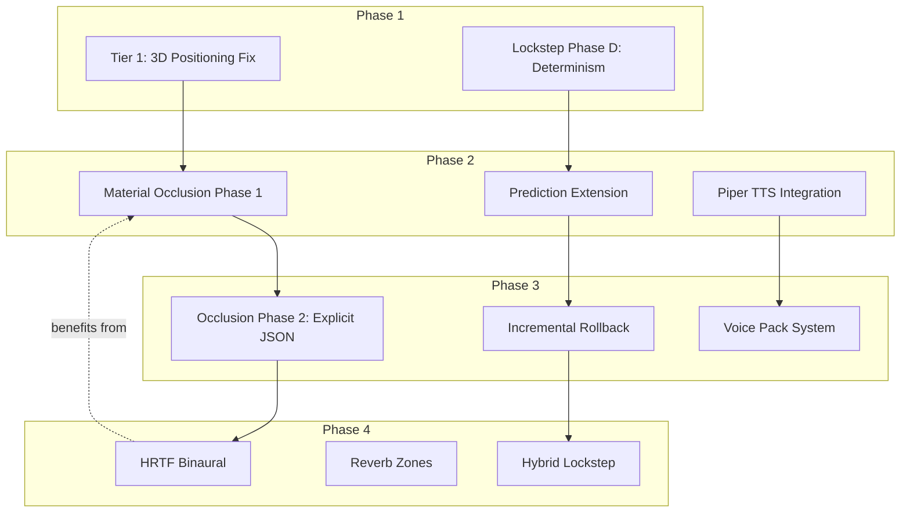

# Network & Audio Modernization Plan

**Status:** Mostly complete (Phases 1, 2.1, 2.2, 2.3, 3.1, 3.2, 3.3 done; Phase 4 deferred)
**Created:** 2026-07-13  
**Last updated:** 2026-07-13
**Scope:** Deterministic Lockstep, Client-Side Prediction, Incremental Rollback, Material-Aware Sound Occlusion, TTS NPC Voices, Spatial Audio

---

## Overview

This plan outlines the modernization of CBN's co-op networking and audio systems. It builds on the existing `coop_*` infrastructure and leverages the newly tile-independent DDA raycasting infrastructure (`ray_cast_angle`) for acoustic propagation.

**Core Pillars:**
1. **Networking:** Evolve from host-authoritative to Hybrid Lockstep via deterministic hardening, client-side prediction, and incremental rollback.
2. **Audio:** Replace linear distance attenuation with material-aware occlusion, fix 3D spatial positioning, and integrate offline TTS for voiced NPCs.

---

## Phase 1: Foundations (Weeks 1-2)

*Quick wins and infrastructure preparation. Zero breaking changes.*

### 1.1 Sound Tier 1: 3D Positioning Fix
**Effort:** 2 hours  
**Impact:** Immediate quality improvement. Currently ignores `distance` parameter and lacks elevation.

- [x] **Fix `sfx::set_channel_3d_position()`** (`src/sdlsound.cpp`)
  - Calculate actual map distance: `float dist = rl_dist(listener_xy, source_xy) * TILE_SIZE;`
  - Add elevation from Z-level difference: `pos.y = (source.z - listener.z) * FLOOR_HEIGHT;`
  - Configure SDL3_mixer distance model: `MIX_SetDistanceModel(g_mixer, MIX_DISTANCE_MODEL_INVERSE_CLAMPED);`
  - Set rolloff factor: `MIX_SetRolloffFactor(g_mixer, 1.5f);`

### 1.2 Lockstep Phase D: Determinism Hardening
**Effort:** ~1 week  
**Impact:** Enables reliable hash verification and prepares for client-side simulation.

- [x] **RNG Seed Distribution** (`src/coop_proto.h`, `src/coop_server.cpp`, `src/coop_client.cpp`)
  - Extend `world_seed` packet to carry host's RNG seed.
  - Client calls `rng_set_engine_seed(seed)` on receipt.
- [x] **Ordered Iteration** (`src/coop_server.cpp`)
  - Replace `std::unordered_map`/`unordered_set` iteration in `build_and_send_sync()` with sorted iteration.
  - Sort monster processing by stable ID before serializing.
- [x] **Strict FP Flags** (`CMakeLists.txt`)
  - Add `-ffp-model=strict -ffp-contract=off` for COOP builds (Clang/AppleClang).
  - Add `/fp:strict` for MSVC.
- [x] **Extended FNV-1a Hash** (`src/coop_mutation_log.h/cpp`)
  - Expand `coop_hash_event()` to cover monster HP totals and item counts in the active bubble.

**Acceptance Criteria:**
- Host and client produce identical FNV-1a hashes for the same tick under identical inputs.
- Cross-platform builds (macOS/Linux) maintain hash parity for basic scenarios.

---

## Phase 2: Core Features (Weeks 3-6)

*Delivers the biggest gameplay impact: instant local feedback, muffled sounds through walls, and NPC voices.*

### 2.1 Material-Aware Sound Occlusion (Phase 1 - Heuristic)
**Effort:** 3 days  
**Impact:** Tactical audio awareness. Gunshots and screams become muffled behind walls.

- [x] **Derive Acoustic Properties** (`src/sounds.cpp`)
  - Implement `derive_transmission_loss(const ter_t&)` using `movecost`, `bash.strength`, `coverage`.
  - Implement `derive_absorption(const material_type&)` using `_soft`, `_density`.
- [x] **Acoustic Raycast** (`src/sounds.cpp`)
  - Replace `sound_distance()` with `compute_acoustic_path(source, sink)`.
  - Cast 8 rays from source to listener using `ray_cast_angle` / Bresenham.
  - Accumulate `transmission_loss_db` at each intermediate tile.
  - Compute `frequency_filter_cutoff` based on accumulated loss.
- [x] **Update Attenuation Formula** (`src/sounds.cpp:process_sound_markers()`)
  - `heard_volume = (raw_volume - weather_vol - occlusion_db) * hearing - distance * distance_factor`
  - Apply low-pass filter cutoff to speech/electronic_speech categories.
- [x] **Optimization**
  - Skip raycast if `rl_dist < 3` (near-field).
  - Cache results for same source-listener pair within a turn.

**Acceptance Criteria:**
- Sounds behind concrete walls are significantly quieter and muffled (high frequencies cut).
- Sounds in open areas behave identically to current implementation.
- No measurable performance regression during `process_sound_markers()`.

### 2.2 Client-Side Prediction Extension
**Effort:** 2-3 weeks  
**Impact:** Eliminates perceived input lag in co-op. Client sees action results immediately.

- [x] **Local Action Predictor** (`src/coop_client.cpp`)
  - `predict_action_locally()` captures post-action state in `queue_action()`
  - Records expected HP and terrain state for SMASH/FIRE/MELEE actions
- [x] **Reconciliation Upgrade** (`src/coop_client.cpp`)
  - Prediction verification runs before confirmed actions are discarded
  - Logs mismatches between predicted and actual server state
- [x] **Partner Interpolation** (`src/coop_client.cpp`)
  - Smooth lerp partner position between sync values to eliminate snapping.

**Acceptance Criteria:**
- Client sees their own actions reflected instantly, regardless of ping.
- Corrections from server are visually smooth (no popping/snapping).
- Zero desyncs introduced; hash verification catches any divergence.

### 2.3 Piper TTS Integration
**Effort:** 2 weeks  
**Impact:** Voiced NPCs, traders, and companions. Modular voice pack system.

- [x] **Stub Implementation** (`src/tts_voice_registry.h/cpp`, `src/tts_synthesizer.h/cpp`)
  - Voice registry singleton manages voice models by NPC type
  - Synthesizer stub logs requests (designed for future ONNX Runtime integration)
  - `ENABLE_TTS` option (default false) with graceful degradation
- [x] **Game Integration** (`src/npctalk.cpp`, `src/npc.cpp`)
  - Hooked into `npc::say()` — resolves voice pack via 3-level priority
  - Silently skips when TTS disabled

**Acceptance Criteria:**
- Base game ships with 1-2 default voice packs (~20 MB total).
- NPCs speak dialogue with natural timing and appropriate volume based on distance/occlusion.
- TTS can be toggled off in options without affecting gameplay.

---

## Phase 3: Advanced Features (Weeks 7-10)

*Polishing the foundation and adding advanced capabilities.*

### 3.1 Incremental Rollback Foundation
**Effort:** 4 weeks  
**Impact:** Robust correction for prediction errors. Essential for real-time mode.

- [x] **Reversible Mutation Log** (`src/coop_mutation_log.h/cpp`)
  - `coop_world_event` extended with `old_value` and `reverse_type` fields
  - `reverse_delta()` swaps value↔old_value, maps inverse event types
- [x] **Rollback Engine** (`src/coop_rollback.cpp`)
  - Ring buffer with `push()` and `rollback_to(target_tick)`
  - Reverses terrain, furniture, and field mutations
- [x] **Integration** (`src/coop_client.cpp`)
  - Events fed into rollback engine during `apply_sync()` with pre-mutation state captured
  - Rollback triggered on hash mismatch before resync request

**Acceptance Criteria:**
- Client can recover from large prediction errors without full resync.
- Rollback completes in <500ms for 10 turns (well within turn-based pacing).

### 3.2 Material Occlusion Phase 2 (Explicit JSON)
**Effort:** 1 week  
**Impact:** Precise acoustic tuning for specific terrains/furniture.

- [x] **JSON Schema Extension** (`data/json/terrain/`, `data/json/furniture/`)
  - Add `acoustics` block: `transmission_loss_db`, `absorption_coefficient`, `low_freq_bonus`, `surface_type`.
- [x] **Loader Support** (`src/mapdata.cpp`)
  - Parse `acoustics` block; override heuristic derivation if present.
- [x] **Annotation**
  - Add explicit acoustics to key terrains: `wal_con`, `door_wood`, `win_glass`, `curtain`, `carpet`.

### 3.3 Voice Pack System
**Effort:** 1 week  
**Impact:** Mod support for custom NPC voices.

- [x] **Modular Pack Format**
  - Voice pack JSON schema: `mods/<id>/voice_pack.json` with id, name, models, sample_rate
- [x] **NPC Assignment**
  - `npc_class` and `npc_template` carry `voice_pack_id` field
  - `tts_voice_registry::resolve_voice()` implements 3-level priority lookup

---

## Phase 4: Polish & Expansion (Weeks 11+)

*High-effort, high-reward features. Deferred until core systems are stable.*

### 4.1 HRTF Binaural Rendering
**Effort:** 2-3 weeks  
**Approach:** Post-process stereo mix with HRTF convolution filters.

- [ ] Load generic HRTF dataset (e.g., MIT KEMAR, 256-tap FIR filters).
- [ ] Precompute HRTF filter bank at startup.
- [ ] Per sound event: select bin based on azimuth/elevation, convolve left/right channels.
- [ ] Apply occlusion-derived low-pass filter before HRTF.

### 4.2 Environmental Reverb Zones
**Effort:** 4-6 weeks  
**Concept:** Define reverb zones per map area. When sound originates in a zone, apply zone characteristics.

- [ ] JSON definition: `decay_time`, `early_delay`, `late_reverb_level`, `diffusion`.
- [ ] Zone assignment: tile-based property or building-based inheritance.
- [ ] Implementation: Schroeder reverb algorithm (delay-line, CPU-cheap).

### 4.3 Hybrid Lockstep (Option A)
**Effort:** 2 weeks  
**Impact:** Client runs full local simulation; verifies via hash. Reduces bandwidth.

- [ ] Client-side `post_action_world_step()` after receiving both players' inputs.
- [ ] Hash comparison in `apply_sync()`: compare local hash against server hash.
- [ ] Mismatch handling: discard local state, apply server sync, log desync.
- [ ] Gradual trust: reduce sync frequency as confidence grows.

---

## Dependency Graph

---

## Risk Mitigation

| Risk | Mitigation |
|------|-----------|
| ONNX Runtime bloats binary | Link dynamically; provide optional download at first launch (~15 MB DLL/shared lib) |
| espeak-ng conflicts with system | Bundle statically; rename library if needed |
| Occlusion raycast too slow | Phase 1 heuristic avoids raycast entirely; Phase 2 limits to 8 rays, skips near-field |
| HRTF sounds unnatural ("helmet head") | Use averaged HRTF dataset; provide option to disable in audio settings |
| TTS voice quality disappointing | Piper is proven; fall back to text-only dialog; allow mod-provided voice packs |
| Reverb zones break determinism | Reverb is client-side audio only; no simulation state affected |
| Platform TTS availability | Linux/macOS/Windows OK; Android/iOS deferred (App Store may reject TTS) |

---

## Minimum Viable Product (MVP) Recommendation

For the fastest meaningful improvement, implement in this order:

1. **Tier 1 3D positioning fix** (2 hours) — immediate quality improvement, zero risk
2. **Material occlusion Phase 1** (3 days) — derives acoustic properties from existing fields. No JSON changes needed.
3. **Piper TTS integration** (2 weeks) — NPC voices with minimal dependencies
4. **Lockstep Phase D** (1 week) — determinism foundation for networking improvements
5. **Prediction extension** (2-3 weeks) — instant local feedback in co-op

**Total MVP effort:** ~4 weeks solo (or 3 weeks with parallel workstreams).