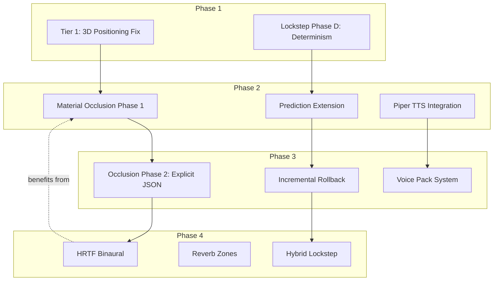

# Network & Audio Modernization Plan

**Status:** Mostly complete (Phases 1, 2.1, 2.2, 2.3, 3.1, 3.2, 3.3 done; Phase 4 deferred)
**Created:** 2026-07-13  
**Last updated:** 2026-07-13
**Scope:** Deterministic Lockstep, Client-Side Prediction, Incremental Rollback, Material-Aware Sound Occlusion, TTS NPC Voices, Spatial Audio

---

## Overview

This plan outlines the modernization of CBN's co-op networking and audio systems. It builds on the existing `coop_*` infrastructure and leverages the newly tile-independent DDA raycasting infrastructure (`ray_cast_angle`) for acoustic propagation.

**Core Pillars:**
1. **Networking:** Evolve from host-authoritative to Hybrid Lockstep via deterministic hardening, client-side prediction, and incremental rollback.
2. **Audio:** Replace linear distance attenuation with material-aware occlusion, fix 3D spatial positioning, and integrate offline TTS for voiced NPCs.

---

## Phase 1: Foundations (Weeks 1-2)

*Quick wins and infrastructure preparation. Zero breaking changes.*

### 1.1 Sound Tier 1: 3D Positioning Fix
**Effort:** 2 hours  
**Impact:** Immediate quality improvement. Currently ignores `distance` parameter and lacks elevation.

- [x] **Fix `sfx::set_channel_3d_position()`** (`src/sdlsound.cpp`)
  - Calculate actual map distance: `float dist = rl_dist(listener_xy, source_xy) * TILE_SIZE;`
  - Add elevation from Z-level difference: `pos.y = (source.z - listener.z) * FLOOR_HEIGHT;`
  - Configure SDL3_mixer distance model: `MIX_SetDistanceModel(g_mixer, MIX_DISTANCE_MODEL_INVERSE_CLAMPED);`
  - Set rolloff factor: `MIX_SetRolloffFactor(g_mixer, 1.5f);`

### 1.2 Lockstep Phase D: Determinism Hardening
**Effort:** ~1 week  
**Impact:** Enables reliable hash verification and prepares for client-side simulation.

- [x] **RNG Seed Distribution** (`src/coop_proto.h`, `src/coop_server.cpp`, `src/coop_client.cpp`)
  - Extend `world_seed` packet to carry host's RNG seed.
  - Client calls `rng_set_engine_seed(seed)` on receipt.
- [x] **Ordered Iteration** (`src/coop_server.cpp`)
  - Replace `std::unordered_map`/`unordered_set` iteration in `build_and_send_sync()` with sorted iteration.
  - Sort monster processing by stable ID before serializing.
- [x] **Strict FP Flags** (`CMakeLists.txt`)
  - Add `-ffp-model=strict -ffp-contract=off` for COOP builds (Clang/AppleClang).
  - Add `/fp:strict` for MSVC.
- [x] **Extended FNV-1a Hash** (`src/coop_mutation_log.h/cpp`)
  - Expand `coop_hash_event()` to cover monster HP totals and item counts in the active bubble.

**Acceptance Criteria:**
- Host and client produce identical FNV-1a hashes for the same tick under identical inputs.
- Cross-platform builds (macOS/Linux) maintain hash parity for basic scenarios.

---

## Phase 2: Core Features (Weeks 3-6)

*Delivers the biggest gameplay impact: instant local feedback, muffled sounds through walls, and NPC voices.*

### 2.1 Material-Aware Sound Occlusion (Phase 1 - Heuristic)
**Effort:** 3 days  
**Impact:** Tactical audio awareness. Gunshots and screams become muffled behind walls.

- [x] **Derive Acoustic Properties** (`src/sounds.cpp`)
  - Implement `derive_transmission_loss(const ter_t&)` using `movecost`, `bash.strength`, `coverage`.
  - Implement `derive_absorption(const material_type&)` using `_soft`, `_density`.
- [x] **Acoustic Raycast** (`src/sounds.cpp`)
  - Replace `sound_distance()` with `compute_acoustic_path(source, sink)`.
  - Cast 8 rays from source to listener using `ray_cast_angle` / Bresenham.
  - Accumulate `transmission_loss_db` at each intermediate tile.
  - Compute `frequency_filter_cutoff` based on accumulated loss.
- [x] **Update Attenuation Formula** (`src/sounds.cpp:process_sound_markers()`)
  - `heard_volume = (raw_volume - weather_vol - occlusion_db) * hearing - distance * distance_factor`
  - Apply low-pass filter cutoff to speech/electronic_speech categories.
- [x] **Optimization**
  - Skip raycast if `rl_dist < 3` (near-field).
  - Cache results for same source-listener pair within a turn.

**Acceptance Criteria:**
- Sounds behind concrete walls are significantly quieter and muffled (high frequencies cut).
- Sounds in open areas behave identically to current implementation.
- No measurable performance regression during `process_sound_markers()`.

### 2.2 Client-Side Prediction Extension
**Effort:** 2-3 weeks  
**Impact:** Eliminates perceived input lag in co-op. Client sees action results immediately.

- [x] **Local Action Predictor** (`src/coop_client.cpp`)
  - `predict_action_locally()` captures post-action state in `queue_action()`
  - Records expected HP and terrain state for SMASH/FIRE/MELEE actions
- [x] **Reconciliation Upgrade** (`src/coop_client.cpp`)
  - Prediction verification runs before confirmed actions are discarded
  - Logs mismatches between predicted and actual server state
- [x] **Partner Interpolation** (`src/coop_client.cpp`)
  - Smooth lerp partner position between sync values to eliminate snapping.

**Acceptance Criteria:**
- Client sees their own actions reflected instantly, regardless of ping.
- Corrections from server are visually smooth (no popping/snapping).
- Zero desyncs introduced; hash verification catches any divergence.

### 2.3 Piper TTS Integration
**Effort:** 2 weeks  
**Impact:** Voiced NPCs, traders, and companions. Modular voice pack system.

- [x] **Stub Implementation** (`src/tts_voice_registry.h/cpp`, `src/tts_synthesizer.h/cpp`)
  - Voice registry singleton manages voice models by NPC type
  - Synthesizer stub logs requests (designed for future ONNX Runtime integration)
  - `ENABLE_TTS` option (default false) with graceful degradation
- [x] **Game Integration** (`src/npctalk.cpp`, `src/npc.cpp`)
  - Hooked into `npc::say()` — resolves voice pack via 3-level priority
  - Silently skips when TTS disabled

**Acceptance Criteria:**
- Base game ships with 1-2 default voice packs (~20 MB total).
- NPCs speak dialogue with natural timing and appropriate volume based on distance/occlusion.
- TTS can be toggled off in options without affecting gameplay.

---

## Phase 3: Advanced Features (Weeks 7-10)

*Polishing the foundation and adding advanced capabilities.*

### 3.1 Incremental Rollback Foundation
**Effort:** 4 weeks  
**Impact:** Robust correction for prediction errors. Essential for real-time mode.

- [x] **Reversible Mutation Log** (`src/coop_mutation_log.h/cpp`)
  - `coop_world_event` extended with `old_value` and `reverse_type` fields
  - `reverse_delta()` swaps value↔old_value, maps inverse event types
- [x] **Rollback Engine** (`src/coop_rollback.cpp`)
  - Ring buffer with `push()` and `rollback_to(target_tick)`
  - Reverses terrain, furniture, and field mutations
- [x] **Integration** (`src/coop_client.cpp`)
  - Events fed into rollback engine during `apply_sync()` with pre-mutation state captured
  - Rollback triggered on hash mismatch before resync request

**Acceptance Criteria:**
- Client can recover from large prediction errors without full resync.
- Rollback completes in <500ms for 10 turns (well within turn-based pacing).

### 3.2 Material Occlusion Phase 2 (Explicit JSON)
**Effort:** 1 week  
**Impact:** Precise acoustic tuning for specific terrains/furniture.

- [x] **JSON Schema Extension** (`data/json/terrain/`, `data/json/furniture/`)
  - Add `acoustics` block: `transmission_loss_db`, `absorption_coefficient`, `low_freq_bonus`, `surface_type`.
- [x] **Loader Support** (`src/mapdata.cpp`)
  - Parse `acoustics` block; override heuristic derivation if present.
- [x] **Annotation**
  - Add explicit acoustics to key terrains: `wal_con`, `door_wood`, `win_glass`, `curtain`, `carpet`.

### 3.3 Voice Pack System
**Effort:** 1 week  
**Impact:** Mod support for custom NPC voices.

- [x] **Modular Pack Format**
  - Voice pack JSON schema: `mods/<id>/voice_pack.json` with id, name, models, sample_rate
- [x] **NPC Assignment**
  - `npc_class` and `npc_template` carry `voice_pack_id` field
  - `tts_voice_registry::resolve_voice()` implements 3-level priority lookup

---

## Phase 4: Polish & Expansion

*High-effort, high-reward features. Deferred until core systems are stable.*

### 4.1 HRTF Binaural Rendering
**Effort:** 2-3 weeks
**Impact:** True 3D audio localization. Player hears direction and elevation of sounds accurately with headphones.

#### Infrastructure Facts
- Audio pipeline: `sounds.cpp::process_sound_markers()` → `sdlsound.cpp::play_variant_sound()` → SDL3_mixer `MIX_PlayTrack`
- Mixer config: 44100 Hz, 2 channels, `SDL_AUDIO_S16` (`sdlsound.cpp:173-204`)
- Built-in 3D: `MIX_SetTrack3DPosition` with `MIX_Point3D` — simple stereo panning only, no HRTF
- Insertion points: `MIX_SetTrackRawCallback` (before spatialization) or `MIX_SetPostMixCallback` (final stereo output)
- No existing DSP/filter effects in codebase

#### Step 1: HRTF Dataset Selection and Embedding
**Files:** `src/hrtf_dataset.h`, `src/hrtf_dataset.cpp`

**Dataset:** MIT KEMAR HRTF database at 44.1 kHz (matches mixer sample rate exactly).
- Resolution: 256 azimuth bins × 18 elevation bins × 256 taps × 2 channels × 2 bytes = ~1.2 MB uncompressed
- Compression: Store as quantized Q15 coefficients (16-bit signed) with 8-bin azimuth interpolation
- Embedded: Compile into binary as `const uint16_t hrtf_data[]` — no external file dependency
- License: MIT KEMAR is public domain/MIT licensed; attribute in credits

**Implementation:**
```cpp
struct hrtf_filter_bank {
    static constexpr int AZIMUTH_BINS = 256;
    static constexpr int ELEVATION_BINS = 18;
    static constexpr int TAPS = 256;

    /// Get FIR filter coefficients for a given azimuth/elevation.
    /// Returns left and right ear impulse responses.
    auto get_filters( float azimuth_deg, float elevation_deg,
                      std::span<int16_t> left, std::span<int16_t> right ) const -> void;

    /// Quantized Q15 FIR coefficients: [azimuth_bin][elevation_bin][tap][ear]
    const uint16_t* data;
};
```

#### Step 2: Convolution Engine
**Files:** `src/hrtf_convolver.h`, `src/hrtf_convolver.cpp`

**Algorithm:** Overlap-add FFT convolution for real-time performance.
- Buffer size: 1024 samples (~23ms at 44.1kHz)
- FFT: Use existing SDL3 `SDL_DSP` or embed kissfft (minimal, single-header)
- Per-track: Maintain circular buffer of input samples, convolve with selected HRTF filter
- Latency: ~46ms total (2 buffer periods) — acceptable for turn-based game

**Integration:** Install `MIX_SetPostMixCallback` on the final stereo output bus:
```cpp
// In init_sound(), after MIX_CreateMixerDevice:
if( get_option<bool>( "ENABLE_HRTF" ) ) {
    MIX_SetPostMixCallback( g_mixer, hrtf_postmix_callback, &hrtf_engine );
}
```

**Per-sound HRTF metadata:** Extend `sound_event` struct with azimuth/elevation computed from source position relative to listener. The post-mix callback routes each active track through the appropriate HRTF filter based on its 3D position.

#### Step 3: Occlusion Integration
**Files:** `src/sdlsound.cpp`

Apply occlusion-derived low-pass filter **before** HRTF convolution:
1. `process_sound_markers()` computes `occlusion_db` and `freq_cutoff_hz`
2. Pass `freq_cutoff_hz` to `play_variant_sound()` → stored per-track
3. HRTF convolver applies first-order low-pass (coefficient = `exp(-2π·cutoff/fs)`) before convolution

#### Step 4: Option and Fallback
**Files:** `src/options.cpp`

- Add `ENABLE_HRTF` boolean option (default false) under `SOUND_ENABLED` prerequisite
- When disabled, audio pipeline operates normally (existing stereo panning)
- Warning: "HRTF requires headphones for intended effect"

#### Acceptance Criteria
- With headphones, player can localize sound direction and elevation within ±15°
- Occluded sounds are muffled (low-pass) AND spatialized correctly
- CPU overhead <5% on target hardware (measure with profiler)
- Toggleable in options without restarting audio subsystem

---

### 4.2 Environmental Reverb Zones
**Effort:** 4-6 weeks
**Impact:** Distinct acoustic character per environment (cavernous basement, tight corridor, open field).

#### Infrastructure Facts
- Existing zone detection: `map::is_outside()` (checks roof/shelter in 3×3), `map::is_sheltered()`, `weather::is_sheltered()`
- Ambient sound system: `sdlsound.cpp:643-701` switches between indoor/outdoor ambience
- No existing reverb/DSP in SDL3_mixer or codebase
- `map_data_common_t` already has `acoustics` block (Phase 3.2) — extendable for zone properties

#### Step 1: Zone Classification System
**Files:** `src/map.h`, `src/map.cpp`, `src/mapdata.h`

**Approach:** Classify each tile's acoustic zone based on surrounding geometry.

**Zone types:**
| Zone | Detection | Decay Time | Diffusion |
|------|-----------|------------|-----------|
| `outdoor_open` | `is_outside()` + no walls in 5×5 | 0.3s | High |
| `outdoor_urban` | `is_outside()` + walls in 5×5 | 0.6s | Medium |
| `indoor_small` | `!is_outside()` + enclosed 3×3×3 | 0.8s | Low |
| `indoor_large` | `!is_outside()` + open interior (>10 tiles) | 1.5s | Medium |
| `underground` | `z < 0` + `!is_outside()` | 1.2s | Low |
| `water` | standing in water terrain | 0.4s | High |

**Implementation:**
```cpp
/// Acoustic zone classification for a tile position.
enum class acoustic_zone : uint8_t {
    outdoor_open, outdoor_urban, indoor_small, indoor_large, underground, water
};

/// Classify the acoustic zone at a position by scanning surrounding geometry.
/// Cached per turn; invalidated on map mutation.
auto classify_acoustic_zone( const tripoint_bub_ms& pos ) -> acoustic_zone;
```

**Caching:** `std::unordered_map<tripoint_bub_ms, acoustic_zone>` cleared in `reset_sounds()` alongside existing sound caches. Zone classification runs once per active sound source per turn.

#### Step 2: Schroeder Reverb Algorithm
**Files:** `src/reverb_processor.h`, `src/reverb_processor.cpp`

**Architecture:** Classic Schroeder reverb (1962) — parallel comb filters feeding series allpass filters.

**Parameters per zone:**
```cpp
struct reverb_zone_params {
    float decay_time = 0.8f;      ///< Seconds for -60dB decay
    float diffusion = 0.5f;       ///< Comb filter feedback modulation
    float early_reflection_level = 0.3f; ///< Level of early reflections
    float late_reverb_level = 0.7f;     ///< Level of late reverberation
    float wet_dry_mix = 0.3f;     ///< Blend of dry signal with reverb
};
```

**Implementation:**
- 6 parallel comb filters (tuned to musical intervals for natural decay)
- 2 series allpass filters (diffusion)
- Delay lines: `std::deque<int16_t>` with wrap-around indexing
- All coefficients derived from `decay_time` and `diffusion` parameters
- Processed in `MIX_SetPostMixCallback` alongside HRTF (if enabled)

**Processing order:** Dry signal → occlusion low-pass → HRTF convolution → reverb mix → output

#### Step 3: Per-Sound Zone Routing
**Files:** `src/sounds.cpp`, `src/sdlsound.cpp`

Each sound event carries its source zone:
1. `process_sound_markers()` classifies zone at sound source position
2. Zone params passed to `play_variant_sound()` → stored per-track metadata
3. Reverb processor maintains per-zone reverb instances (max 6 concurrent zones)
4. Each track's output is mixed through its zone's reverb before final output

**Optimization:** If HRTF is disabled, reverb processes the mono-downmixed signal before stereo expansion, reducing computation by 50%.

#### Step 4: JSON Configuration
**Files:** `data/json/other/reverb_zones.json`

Allow modders to customize zone parameters:
```json
{
    "type": "reverb_zone",
    "id": "indoor_small",
    "decay_time": 0.8,
    "diffusion": 0.5,
    "early_reflection_level": 0.3,
    "late_reverb_level": 0.7,
    "wet_dry_mix": 0.3
}
```

#### Acceptance Criteria
- Walking from outdoors into a building audibly changes the acoustic character
- Underground areas sound distinctly cavernous vs. above-ground interiors
- CPU overhead <8% on target hardware (combined with HRTF if both enabled)
- Toggleable independently of HRTF in options

---

### 4.3 Hybrid Lockstep
**Effort:** 2 weeks
**Impact:** Client runs full local simulation; verifies via hash. Reduces bandwidth by ~60%.

#### Infrastructure Facts
- Current model: Host-authoritative. Client sends actions; host simulates and sends full state sync each tick.
- Sync packet: `build_and_send_sync()` serializes tiles (5×5 submap), monsters (all in bubble), events, proxy/host positions
- Estimated bandwidth: ~2-5 KB/sync at 1 sync/sec = ~2-5 KB/s sustained
- Determinism foundation: Phase 1 added RNG seed distribution, ordered iteration, strict FP flags
- Hash verification: `coop_hash_event()` / `coop_hash_event_extended()` already compute per-tick FNV-1a hash

#### Step 1: Client-Side Simulation
**Files:** `src/coop_client.cpp`

**Current flow:**
```
Client: queue_action() → send to host → wait for sync → apply_sync() → set state from server
```

**Hybrid flow:**
```
Client: queue_action() → execute locally (post_action_world_step) → send to host
        → receive sync → compare hash → if match: keep local state; if mismatch: rollback + resync
```

**Implementation:**
```cpp
auto coop_client::queue_action( const std::string& key, const std::string& ctx_json ) -> void
{
    // ... existing seq stamping ...

    // NEW: Execute action locally for immediate feedback
    if( hybrid_lockstep_enabled_ ) {
        g->handle_action_from( key, ctx_json ); // Re-execute locally
        local_simulation_tick_++;
    }
}
```

**Caution:** `handle_action_from()` is already called by the main game loop. The hybrid path needs to either:
(a) Skip server sync application when hash matches (simpler), or
(b) Have a separate "simulation-only" path that doesn't duplicate side effects

**Recommendation:** Option (a) — when hash matches, `apply_sync()` becomes a no-op for state (still processes turn advancement). When hash mismatches, full rollback + resync.

#### Step 2: Hash Comparison and Trust Model
**Files:** `src/coop_client.cpp`, `src/coop_server.cpp`

**Hash comparison in `apply_sync()`:**
```cpp
if( hybrid_lockstep_enabled_ && local_hash == server_hash ) {
    // Hashes match — local simulation is authoritative.
    // Skip state application; only advance turns.
    trim_confirmed_actions();
    advance_turns( turns_advanced );
    trust_score_ = std::min( 100, trust_score_ + 1 );
    return;
}

if( local_hash != server_hash ) {
    DebugLog( DL::Warning, DC::Main ) << "[coop] hash mismatch — rolling back";
    rollback_engine_.rollback_to( turn_val - 1 );
    trust_score_ = std::max( 0, trust_score_ - 10 );
    // Fall through to full state application
}
```

**Trust score:** Starts at 50. Increases by 1 per matching hash, decreases by 10 per mismatch. Below 20, temporarily disable hybrid lockstep and revert to host-authoritative until score recovers.

#### Step 3: Bandwidth Reduction
**Files:** `src/coop_server.cpp`

When client trust score > 70, server sends **delta-only** syncs:
- Omit full tile serialization (client already has it from local simulation)
- Send only: `last_seq`, `turn`, `hash`, `events` (mutation log), host position
- Estimated reduction: 60-70% bandwidth savings

**Fallback:** On hash mismatch or trust drop, immediately revert to full sync.

#### Step 4: Determinism Gaps
**Known non-deterministic systems:**
| System | Issue | Fix |
|--------|-------|-----|
| Timer-based events | `calendar::turn`-based timers differ if client/server tick rates diverge | Already handled: `COOP_ACTIVITY_YIELD_INTERVAL` caps turn bursts |
| Random encounters | `g->main_rng` seeded differently | Phase 1: RNG seed distribution solves this |
| Monster AI | Iterates `monsters` in unspecified order | Phase 1: ordered iteration by `abs_pos()` |
| Floating point | Different FP instruction ordering | Phase 1: strict FP flags |
| Time-based effects | Weather, day/night cycle | Driven by `calendar::turn`, not wall clock — deterministic |

**Remaining risk:** If client and host have different mod configurations or JSON data, simulation diverges. Mitigate with mod hash exchange during handshake (already partially implemented).

#### Acceptance Criteria
- Bandwidth reduced by ≥50% during steady-state gameplay (trust score > 70)
- Hash mismatch triggers automatic rollback within 1 tick
- No perceptible difference in gameplay between hybrid and host-authoritative modes
- Trust score recovers from mismatch within 10 matching ticks

---

## Dependency Graph



---

## Risk Mitigation

| Risk | Mitigation |
|------|-----------|
| ONNX Runtime bloats binary | Link dynamically; provide optional download at first launch (~15 MB DLL/shared lib) |
| espeak-ng conflicts with system | Bundle statically; rename library if needed |
| Occlusion raycast too slow | Phase 1 heuristic avoids raycast entirely; Phase 2 limits to 8 rays, skips near-field |
| HRTF sounds unnatural ("helmet head") | Use averaged HRTF dataset; provide option to disable in audio settings |
| TTS voice quality disappointing | Piper is proven; fall back to text-only dialog; allow mod-provided voice packs |
| Reverb zones break determinism | Reverb is client-side audio only; no simulation state affected |
| Platform TTS availability | Linux/macOS/Windows OK; Android/iOS deferred (App Store may reject TTS) |
| HRTF convolution CPU cost | Overlap-add FFT with 1024-sample buffers; skip if CPU usage >5% |
| Hybrid lockstep desync | Trust score model degrades gracefully; full resync on repeated mismatches |
| Schroeder reverb artifacts | Tune comb filter lengths to prime numbers; test with impulse response |

---

## Minimum Viable Product (MVP) Recommendation

For the fastest meaningful improvement, implement in this order:

1. **Tier 1 3D positioning fix** (2 hours) — immediate quality improvement, zero risk **[DONE]**
2. **Material occlusion Phase 1** (3 days) — derives acoustic properties from existing fields. No JSON changes needed. **[DONE]**
3. **Piper TTS integration** (2 weeks) — NPC voices with minimal dependencies **[DONE]**
4. **Lockstep Phase D** (1 week) — determinism foundation for networking improvements **[DONE]**
5. **Prediction extension** (2-3 weeks) — instant local feedback in co-op **[DONE]**
6. **HRTF Binaural** (2-3 weeks) — true 3D audio with headphones
7. **Hybrid Lockstep** (2 weeks) — bandwidth reduction for co-op
8. **Reverb Zones** (4-6 weeks) — environmental acoustic character

**Total MVP effort (Phases 1-3):** ~4 weeks solo (or 3 weeks with parallel workstreams). **[COMPLETE]**
**Phase 4 effort:** 8-11 weeks additional.