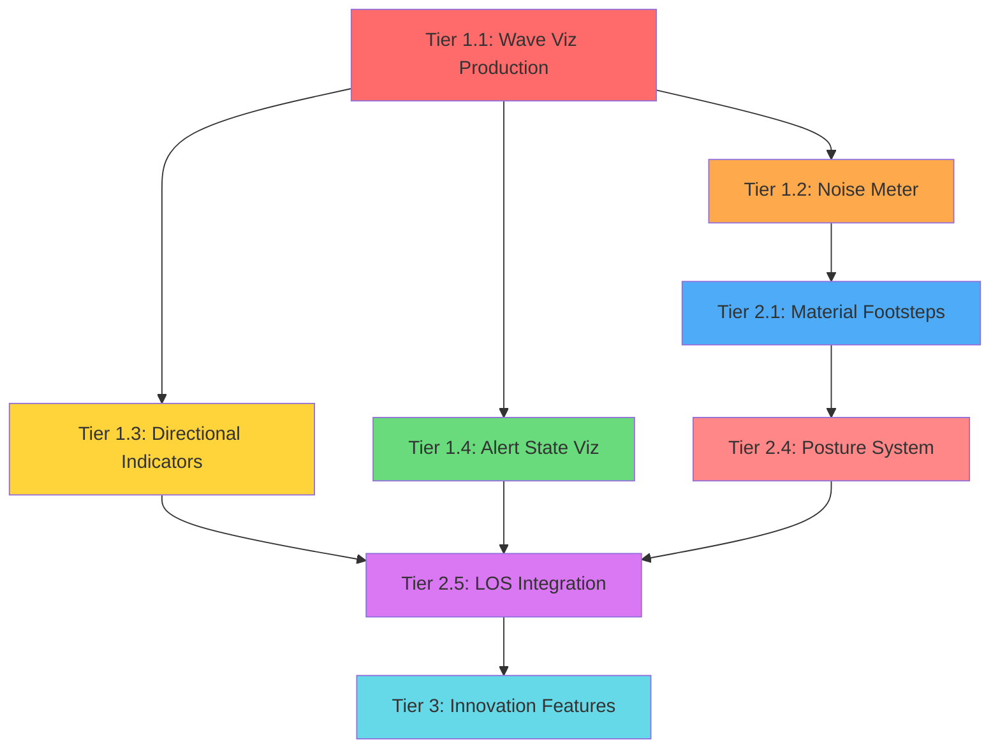

# Sound & Stealth System Roadmap

## Status
Draft v1 — compiled from codebase research. Ready for prioritization.

## Reference Games
| Game | Key Mechanics |
|------|--------------|
| **Mark of the Ninja** | Silhouette rendering, expanding sound rings, enemy cone-of-vision, noise masking by environment |
| **Dishonored** | Chaos system, sound propagation through walls, enemy alert states with visual feedback, wardens |
| **Splinter Cell** | Light/shadow stealth, third-person awareness meters, sound-based detection, third-eye gadget |
| **Metal Gear Solid** | Binocular view, noise meter, patrol route disruption, alarm/chase modes |
| **Assassin's Creed** | Detection meter, crowd blending, eagle vision, social stealth |

---

## Current CBN Architecture

### Sound Engine (`src/sounds.cpp`)
Two-layer system: game logic + SDL audio playback.

**Game Logic Layer:**
- `sounds::sound()` — records sound events (position, volume, category, description)
- `sound_distance()` — distance metric with underground attenuation
- `compute_occlusion_along_ray()` — 8-ray diffraction averaging, LRU cache (512 entries)
- `derive_transmission_loss()` — explicit acoustics from `map_acoustics_info` or bash-strength heuristic fallback
- `cluster_sounds()` — K-means clustering for monster AI performance (prevents combinatorial explosion)
- `process_sounds()` — alerts monsters and hordes to sound clusters
- `process_sound_markers()` — notifies player, handles deafening/wake-up logic
- `_snapshot_sound_visualization()` — per-frame heatmap cache for debug overlay

**Sound Categories (`sounds::sound_t`):**
`movement`, `alert`, `music`, `ambient`, `activity`, `destructive_activity`, `combat`, `vehicle`, `animal`, `weather`, `misc`, `_LAST`

**SDL Audio Layer (`src/sdlsound.cpp`):**
- SDL3_mixer with 3D spatial audio (`set_channel_3d_position`)
- Ambient environment channels: weather, time_of_day, context_themes, fatigue groups
- Music streaming, SFX predecode pool (64 tracks)
- Fade management, volume control
- Soundpack loading from JSON (`data/sound/Basic/soundset.json`)
- TTS stub infrastructure (abstract base class, ONNX Runtime target)

### Hearing Pipeline
**Characters (`Character::can_hear`):**
- Distance-based with weather attenuation
- `hearing_ability()` multiplier: bionics, mutations, deafness, earphones

**Monsters (`monster::hear_sound`):**
- Flags: `MF_HEARS`, `MF_GOODHEARING` (doubles range)
- Volume-based targeting with error margin
- `wander_to` behavior on hearing
- Morale-dependent: flee vs attract
- `process_trigger(SOUND)` integration

**NPCs (`npc::handle_sound`):**
- Priority-based reaction system
- Ignores ally sounds below alarm threshold
- Investigates sounds within distance threshold
- Respects zones (`no_investigate` / `investigate_only`)
- Builds `sound_alerts` queue for pathfinding
- `npc_investigate_sound` action with return-to-guard-pos fallback and stuck detection

### Acoustic Materials (`map_acoustics_info`)
| Property | Range | Purpose |
|----------|-------|---------|
| `transmission_loss_db` | -1 (heuristic) to 0-50 | How much sound the surface blocks |
| `absorption_coefficient` | 0-1 | How much sound energy is absorbed |
| `low_freq_bonus` | varies | Low-frequency sound penetration bonus |
| `surface_type` | enum | Classification for heuristic fallback |

**Sample values:**
- Walls: 6-12 dB transmission loss
- Doors: 5-8 dB
- Glass: 1.5-3 dB
- Carpet: 0 dB, 0.7 absorption coefficient

### Weather Attenuation (`data/json/weather_type.json`)
| Condition | `sound_attn` |
|-----------|-------------|
| Clear | 0 |
| Light rain | 2-3 |
| Heavy rain | 5-6 |
| Thunderstorm | 8 |

### Visualization (Production)
- **Tile heatmap** (F5 debug overlay): per-tile intensity coloring (blue→green→yellow→red)
- **Occlusion desaturation**: walls reduce color saturation
- **Ray path highlighting**: acoustic rays from source to listener
- **Source markers**: position indicators with percentage labels
- **Sound markers**: placed on minimap for unseen sources

### Visualization (Debug-Only)
- **Animated wavefront pulses** (F4 panel sound spawner): expanding cyan wavefront with flood-fill occlusion
- **Auto-cleanup** after animation lifetime expires
- **Moved outside F5 gate** (fixed this session)

---

## Feature Gap Analysis

### Tier 1: Foundation (Must Have)
*Things that make the system playable and useful.*

#### 1.1 Permanent Sound Wave Visualization
**Status:** Exists as debug feature. Needs promotion to production.
- [ ] Make wavefront animation always-visible when sound occurs (configurable)
- [ ] Color-code by sound category (combat=red, movement=amber, ambient=blue)
- [ ] Scale wavefront size by volume
- [ ] Persist trail for configurable duration (not just animation lifetime)
- [ ] Toggle in options, not just F4 panel

#### 1.2 Player Noise Meter
**Status:** Does not exist.
- [ ] Real-time noise level indicator (HUD element)
- [ ] Shows current noise footprint (footsteps, breathing, equipment)
- [ ] Visual feedback when performing noisy actions
- [ ] Threshold indicators: "quiet enough" vs "will attract attention"
- [ ] Reference: MGS noise meter, Splinter Cell awareness indicator

#### 1.3 Directional Sound Indicators
**Status:** Partial (sound markers exist but lack direction).
- [ ] Arrows pointing toward/away from sound sources
- [ ] Arrow intensity proportional to volume
- [ ] Persistent until source is located or sound fades
- [ ] Reference: Mark of the Ninja sound direction rings

#### 1.4 Enemy Alert State Visualization
**Status:** Exists internally, not visible to player.
- [ ] Visual indicator on enemies showing their awareness state
- [ ] States: casual → listening → investigating → alarmed → chase
- [ ] Cone-of-vision overlay when enemy is investigating
- [ ] Reference: Dishonored enemy alert icons, Splinter Cell awareness dots

### Tier 2: Polish (Should Have)
*Things that make the system feel professional and competitive.*

#### 2.1 Material-Aware Footstep Noise
**Status:** Terrain-dependent footsteps exist. Could be richer.
- [ ] Surface type affects footstep volume (carpet < wood < metal)
- [ ] Footwear modifies surface interaction (boots vs sneakers vs barefoot)
- [ ] Crouching/prone reduces noise multiplier
- [ ] Encumbrance increases noise (heavy gear clanks)
- [ ] Reference: MGS surface noise system

#### 2.2 Environmental Sound Masking
**Status:** Weather attenuation exists. No masking model.
- [ ] Loud environments reduce detection range (rain masks footsteps)
- [ ] Machinery noise creates "safe zones" for movement
- [ ] Visual representation: masking shown as reduced wavefront range
- [ ] Reference: Mark of the Ninja rain masking

#### 2.3 Vertical Sound Propagation
**Status:** Z-level exists but treated independently.
- [ ] Sound travels between floors (stairs, shafts, thin ceilings)
- [ ] Floor construction affects transmission (wood > concrete)
- [ ] Visual: cross-floor wavefront rendering
- [ ] Reference: Dishonored vertical awareness

#### 2.4 Stealth Posture System
**Status:** Basic crouch exists. No formal posture system.
- [ ] Standing: normal speed, normal noise
- [ ] Crouching: slower, quieter, lower profile
- [ ] Prone: slowest, quietest, hardest to spot
- [ ] Each posture affects: noise, visibility, speed, interaction range
- [ ] Reference: Splinter Cell posture system

#### 2.5 Line-of-Sight Integration
**Status:** Visibility system exists separately from sound.
- [ ] Combine sound + sight into unified detection model
- [ ] Enemy must HEAR AND LOCATE to investigate effectively
- [ ] Sound narrows search area; sight confirms
- [ ] Visual: combined threat overlay (sound + sight cones)
- [ ] Reference: Splinter Cell detection model

### Tier 3: Innovation (Nice to Have)
*Things that push beyond reference games.*

#### 3.1 Sound Echo / Reverberation
- [ ] Enclosed spaces amplify and prolong sound
- [ ] Echo reveals room geometry (meta-information for player)
- [ ] Visual: secondary wavefronts bouncing off walls
- [ ] Reference: unique to CBN's tile-based world

#### 3.2 Dynamic Patrol Disruption
- [ ] Monsters update patrol routes based on repeated sounds
- [ ] "Haunted" areas get increased patrols
- [ ] NPCs share information about sound sources
- [ ] Reference: Dishonored warden system

#### 3.3 Active Camouflage / Decoys
- [ ] Items that create fake sound sources (throw noise makers)
- [ ] Sound-based distractions (banging pots, shooting in distance)
- [ ] Visual: decoy wavefronts indistinguishable from real ones
- [ ] Reference: MGS decoy grenades

#### 3.4 Sound Memory System
- [ ] Enemies remember sound locations for a duration
- [ ] Returning to a previously noisy area triggers caution
- [ ] Visual: lingering "echo markers" on minimap
- [ ] Reference: unique mechanic

#### 3.5 Social Stealth Integration
- [ ] Blending into crowds reduces detection
- [ ] Wearing uniforms/factions affects NPC reaction
- [ ] Sound matters less when socially concealed
- [ ] Reference: Assassin's Creed crowd blending

#### 3.6 Predator/Prey Sound Ecology
- [ ] Different species hear different frequencies
- [ ] Some sounds attract predators, others scare them
- [ ] Animal behavior affected by player noise
- [ ] Reference: unique to CBN's living world

---

## Technical Debt / Known Issues

### Sound System
- [ ] `Creature::hear_sound` has TODO for generalization
- [ ] Fleeing attitudes incomplete (TODO in monster.cpp)
- [ ] Point types not generalized (TODO in sounds.cpp)
- [ ] TTS synthesizer is stub (ONNX Runtime target, not implemented)
- [ ] Soundpack JSON only has 2 entries (`menu_move`, `menu_error`)
- [ ] `sfx::play_variant_sound()` silently no-ops for missing sound IDs

### Visualization
- [ ] Sound heatmap is debug-only (F5 gate)
- [ ] Wavefront animation is debug-only (F4 panel)
- [ ] No production sound visualization in normal gameplay
- [ ] Sound markers lack directional information

### Stealth
- [ ] No formal stealth meter or HUD indicator
- [ ] Posture system is basic (crouch only)
- [ ] No social stealth mechanics
- [ ] Enemy alert states not visible to player
- [ ] No integration between sound and visibility systems

---

## Implementation Dependencies

---

## Session Notes
- Sound pulse rendering fixed: now renders without F5 debug HUD
- Click-through fixed: F4 panel no longer blocks world clicks
- `sounds::sound()` only records events; `sfx::play_variant_sound()` needed for audio
- `debugmsg()` is modal — use `DebugLog()` for diagnostics
- `s_emo` populated unconditionally when game loaded (not F5-gated)